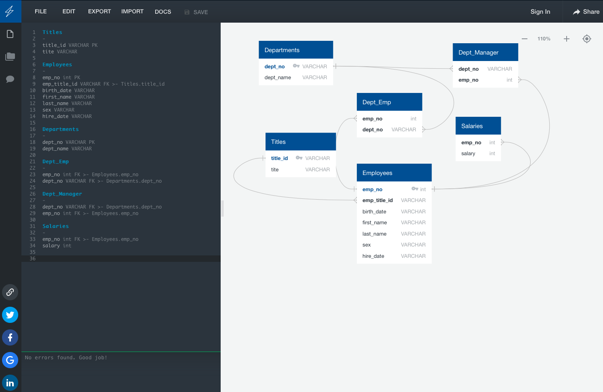
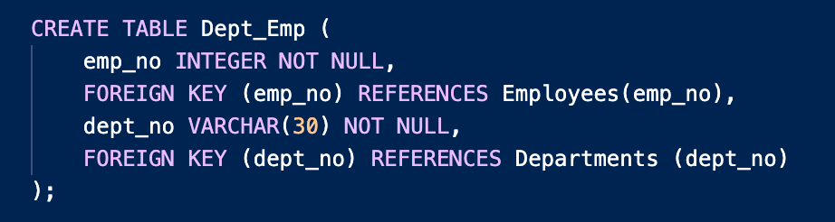
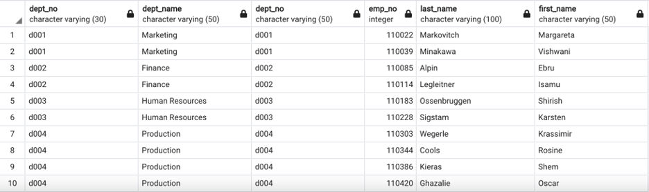

# SQL Challenge - A Mystery in Two Parts

## Background

To design tables to hold the data from CSVs, import the CSVs into a SQL database, and answer questions about the data.

## Data Engineering/Data Modeling

### Entity Relationship Diagram (ERD)

Utilizing the site (https://www.quickdatabasediagrams.com), create an ERD showing relationships between the data provided.

Create the schema to import the CSV.

*Example of one table creation*

## Data Analysis

### Queries

Execute a series of queries once the database has been completed to obtain information on employees, managers, and departments.

*Example of one query result in SQL table format*

## Bonus
